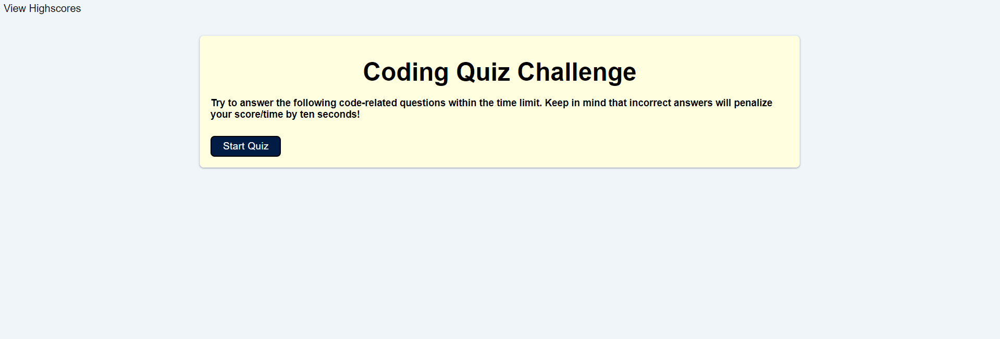

"# Code-Quiz" 
# Description:
## Code quiz with highscores
 

### Within this website, there will be a 'View Highscores' in the top left, Coding 'Quiz Challenge' with text in the center screen, and a 'Start Quiz' button below that.

### When Start Quiz is clicked, the quiz will begin and a timer will start in the top left with 60 seconds.
#### If the timer goes to 0, the quiz will stop and the page will change to 'All done!.'
 

#### If correct answers are chosen, the quiz will proceed to the next question.
#### If incorrect answers are chosen, 10 seconds will be removed from the timer and the quiz will proceed to the next question.
 

#### If all questions are answered or the timer goes to 0, the page will go to 'All done!', where a 'Enter Initials' textbox and 'Submit' button will appear.
 

#### Once initials have been added, the page will change to 'Highscores', where highscores and initials are saved to local storage. scores are sorted by highest score.
#### Two options are provided: 'Go Back' and 'Clear Highscores'
##### 'Go Back' will return to the start quiz page.
##### 'Clear Highscores' will clear the highscores from local storage and return to the start quiz page.
 

# Screenshot Below:

 
 

# URL Links:
 
## Password Generator: https://morganegilbert.github.io/Code-Quiz/
